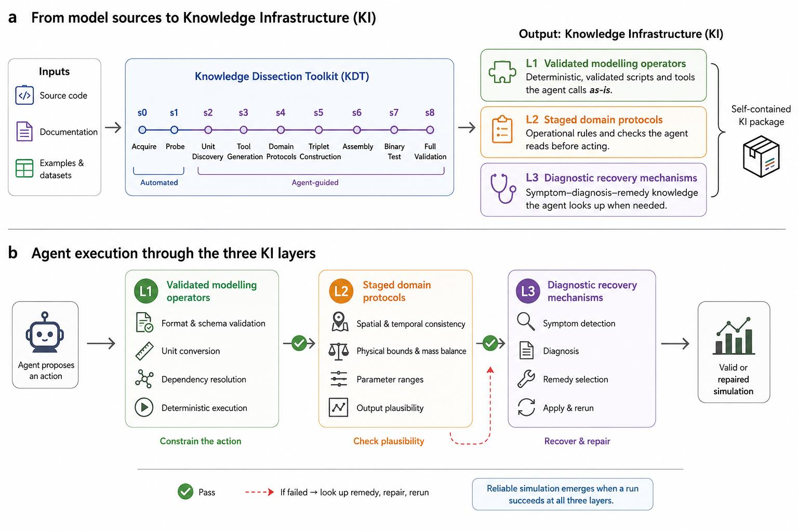

# KISS — Knowledge Infrastructure for Scientific Simulation

**An agent-actionable scaffold that externalizes operational expertise so AI agents can reliably run, check, and extend process-based scientific models.**


[Explore the live catalogue](https://app.geoforgehhu.com) · [Build KI with KDT](https://github.com/lzwei196/KDT-single) · [Read the paper](https://arxiv.org/abs/2605.17856)

<p align="center">
  
</p>

<p align="center"><em>Knowledge dissection converts operational expertise into agent-usable Knowledge Infrastructure. Figure 2 from the KISS manuscript.</em></p>

## What is Knowledge Infrastructure?

Running a scientific model requires more than knowing its equations. Practitioners also know how to prepare model-specific inputs, how to decide whether each intermediate state is scientifically plausible, and how to recover when a run fails silently or indirectly. That operational expertise is often scattered across source code, documentation, example cases, and specialist practice.

**Knowledge Infrastructure (KI)** makes that expertise explicit and usable by a general-purpose coding agent. It separates operational knowledge into three complementary forms:

| Knowledge type | The question it answers | Representation in KI | Role during execution |
|---|---|---|---|
| **Procedural** | How should this operation be performed? | **Validated modelling operators** | Constrain actions through deterministic tools for format conversion, unit handling, dependency resolution, and execution |
| **Evaluative** | Is the workflow still correct and scientifically plausible? | **Staged domain protocols** | Gate progress using spatial and temporal consistency, physical bounds, mass balance, parameter ranges, and output checks |
| **Diagnostic** | Why did the run fail, and how should it recover? | **Diagnostic recovery mechanisms** | Map symptoms to diagnoses and validated remedies, then repair and rerun |

Reliable simulation emerges when an execution path satisfies all three constraints. Without procedural knowledge, agents perform invalid operations. Without evaluative knowledge, erroneous states propagate. Without diagnostic knowledge, agents cannot recover from silent or indirect failures.

## From tacit expertise to an executable scaffold

The **Knowledge Dissection Toolkit (KDT)** extracts operational expertise from model source code, documentation, examples, datasets, and expert practice. It packages that expertise as a self-contained KI that an agent can:

- **read** to understand the model, its dependencies, and its operational sequence;
- **call** to execute validated, model-specific operations; and
- **query** to check intermediate results or recover from failures.

KISS leaves the governing equations untouched. The agent operates the original process-based model; KI changes the operational interface around it.

```text
Model sources ── knowledge dissection ──► KI package ── agent execution ──► valid or repaired simulation
                                               │
                         ┌─────────────────────┼─────────────────────┐
                         │                     │                     │
                    Procedural            Evaluative            Diagnostic
                  constrain action      check plausibility      recover & repair
```

## What this resource provides

The paper introduces four connected resources:

1. **The KI design** — a three-layer scaffold for procedural, evaluative, and diagnostic knowledge.
2. **KDT** — a knowledge-dissection toolkit for building KI packages for new models.
3. **An agent-driven simulation benchmark** — a depth test of KI on a coupled VIC–Lohmann hydrological workflow.
4. **A public catalogue** — 119 evaluated KI packages spanning 14 Earth-science domains, operated through a common interface.

This repository contains the model-level knowledge artifacts. The frozen cohort reported in the manuscript comprises:

| Construction mode | KI packages | Validation depth |
|---|---:|---|
| Hand-built depth test | **2** | VIC and Lohmann routing; evaluated in the 3,000-trial benchmark |
| Expert-supervised KDT transfer set | **25** | Three sites per model and three independent agent sessions per site |
| Fully autonomous KDT scaling set | **92** | 59 observation-validated; 33 verified runnable on synthetic, example, or analytical inputs |
| **Total evaluated in the paper** | **119** | **14 Earth-science domains** |

The repository may evolve beyond the frozen manuscript cohort. All study-scale numbers in this README refer to the 119-package evaluation reported in the paper.

## What a KI package contains

Package layouts vary with the underlying model, but the artifacts serve the same three knowledge layers:

```text
models/<MODEL>/
├── SKILL.md or SKILL_en.md          # operational entry point and staged guidance
├── tools/ and stage scripts         # validated modelling operators
├── dag.yaml                         # execution order, dependencies, and gates
├── knowledge_infrastructure.yaml    # machine-readable KI manifest
├── docs/
│   ├── format_spec.yaml             # input/output schemas and units
│   ├── validation_convention.yaml   # domain-appropriate acceptance rules, where available
│   └── REFERENCES.md                # provenance for operational claims
├── diagnostics/
│   └── triplets.yaml or triplets.md # symptom → diagnosis → remedy knowledge
└── preflight_check.py               # pre-execution consistency checks
```

| KI layer | Typical repository artifacts |
|---|---|
| Validated modelling operators | `tools/*.py`, preparation stages, run and scoring scripts |
| Staged domain protocols | `SKILL.md`, `dag.yaml`, `format_spec.yaml`, validation conventions, preflight checks |
| Diagnostic recovery mechanisms | `diagnostics/triplets.yaml`, error logs, symptom–diagnosis–remedy records |

## Evidence from the paper

### Depth: KI enables reliable agentic simulation

The depth benchmark tested a coupled VIC–Lohmann workflow with **14 milestones**. Ten command-line coding agents from five independent platforms attempted the workflow across three Huai River basins in **3,000 independent trials**.

- KI-equipped agents completed valid end-to-end simulations in **up to 84%** of trials.
- With KI removed, **no agent exceeded 40%** completion.
- A successful trial had to complete all 14 milestones and produce discharge with **Nash–Sutcliffe efficiency ≥ 0.2**.
- The ablation failures mapped directly to the missing layers: invalid operations without validated operators, implausible results without staged protocols, and unresolved error loops without diagnostic recovery.

### Scale: KI construction transfers across models and domains

- KDT produced KI for **117 additional models**, bringing the total evaluation to **119 models across 14 domains**.
- In the 25-package expert-supervised set, **60 of 75 model–site combinations (80.0%)** met domain-specific quantitative criteria; no execution failures occurred.
- The autonomous set contained **92 packages**: **59** validated against observational data and **33** verified runnable using synthetic, example, or analytical inputs.

### Structure: operational expertise converges

The cross-domain corpus supports the paper's central premise that operational expertise is structured and extractable rather than ad hoc:

- **835 tools** were classified across seven conserved functional categories plus an `OTHER` residual.
- Across **2,406 diagnostic recovery mechanisms**, unit-conversion and input/output-format errors accounted for **55%** of anticipated failures and appeared in every domain.
- Domain failure profiles were similar, with median pairwise **Spearman's ρ = 0.75**.
- **3,478 decision points** clustered into 11 categories. Parameter selection, physics-option configuration, and unit-system specification appeared in every domain and accounted for **55%** of all decisions.

## Quick start

The repository is a collection of KI packages rather than a single installable Python distribution.

```bash
git clone https://github.com/lzwei196/KISS---Knowledge-Infrastructure-for-Scientific-Simulation.git
cd KISS---Knowledge-Infrastructure-for-Scientific-Simulation

# Browse the available model packages
ls models/

# Start with a package's operational entry point
sed -n '1,160p' models/VIC/SKILL_en.md

# Inspect its operators, protocols, and diagnostic knowledge
find models/VIC -maxdepth 2 -type f | sort
```

Then point an agent at the package with a task such as:

> Read `models/VIC/SKILL_en.md`. Resolve the required binary, data, and environment paths; follow the staged protocol; use the validated operators rather than regenerating them; and consult the diagnostic recovery mechanisms if a check fails. Run VIC for **[site and period]** and report every validation gate.

Model binaries and large forcing or observational datasets are not bundled uniformly with every KI package. Read the package's operational reference and provenance files before execution, and connect the referenced dependencies to your environment.

## Repository layout

```text
.
├── README.md
├── models/                          # model-specific KI packages
├── CLAUDE_TEMPLATE.md               # reusable agent instruction template
├── AGENT_SERVICE_GUIDE.md           # agent-service deployment examples
├── DEPLOYMENT.md                    # infrastructure setup notes
├── revalidation_3x3_results.xlsx    # expert-supervised validation record
└── kdt-release.zip                  # archived toolkit/shared-library snapshot
```

## Related resources

- **KI catalogue and execution environment:** [GeoForge](https://app.geoforgehhu.com)
- **Knowledge Dissection Toolkit:** [KDT-single](https://github.com/lzwei196/KDT-single)
- **Paper:** [KISS — Knowledge Infrastructure for Scientific Simulation: A Scaffolding for Agentic Earth Science](https://arxiv.org/abs/2605.17856)

## Citation

If you use KISS or its KI packages, please cite:

```bibtex
@article{li2026kiss,
  title         = {KISS - Knowledge Infrastructure for Scientific Simulation: A Scaffolding for Agentic Earth Science},
  author        = {Li, Ziwei and Zhu, Liujun and Liu, Yuchen and Zhao, Yichen and Li, Birk and Wu, Ruiqi and Jin, Junliang and Zhang, Jianyun},
  journal       = {arXiv preprint arXiv:2605.17856},
  year          = {2026},
  eprint        = {2605.17856},
  archivePrefix = {arXiv},
  url           = {https://arxiv.org/abs/2605.17856}
}
```

## License

Released under the [MIT License](LICENSE). Copyright © 2026 Jianyun Zhang Research Group, Hohai University.
