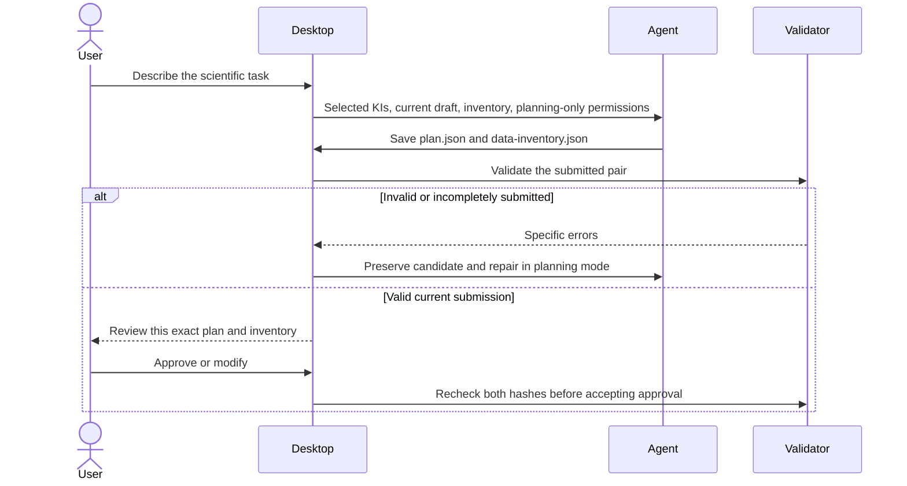

# KI harness and desktop planning handoff: repair report

The reproduced failure was primarily a desktop orchestration defect, not a failure to load the current KI harness and not a general inability to use Chinese. A loaded contract does not, by itself, make the host preserve an agent's plan, enforce permissions, or bind user approval to the correct files.

Date: 2026-08-31. Scope: planning and approval handoff, with real Claude Code, OpenAI Codex and Kimi Code sessions. No scientific run was approved in these tests.

## 🔎 What went wrong

| Fault | Observable consequence | Repair |
|---|---|---|
| Claude absolute file grants used `/Users/...` instead of `//Users/...` | Claude could read the task but its plan writes were denied | Normalize absolute POSIX and Windows grant paths; retain spaces and Unicode |
| Replacing CLI options did not consume variadic values; Codex inherited two sandbox settings | Stray permission arguments or a startup error before any plan could be submitted | Replace flags and their complete values, including `--flag=value` and variadic grants |
| Isolated planning copies and canonical project files were not reliably handed off | A reviewed draft could be lost or an untouched generated draft could be offered for approval | Preserve the submitted pair, validate it first, check for concurrent edits, then publish it |
| Exit status and current-turn submission were not required | A failed CLI, or a final answer without saved files, could appear to have completed planning | Require successful completion and a current submission of both files; API providers use an explicit `write_plan` submission |
| Preparation-only wording and punctuation could evade resolution | `VIC-CaMa，` could lose CaMa, or input preparation could miss the planning gate | Expand preparation intent detection and split Unicode punctuation consistently |
| Tool validation assumed every executable lived in `tools/` | Real legacy KI stage tools were rejected | Also accept existing `sN_stage/` scripts explicitly referenced by the KI protocol; reject arbitrary files and escaping symlinks |
| Validation failures were not returned as a usable repair task | The agent stopped with a malformed plan and the user had to relay the error | Preserve the failed candidate, return exact errors, and retry in planning-only mode |
| Setup/execution instructions were mixed into the planning prompt | The agent tried to write status/request files or run preflight despite the planning restriction | Let the host own status and approval files; planning instructions authorize only the two draft files |
| A pending review was not bound tightly enough to both files | Files could change between presentation and approval | Store and recheck canonical hashes of both the plan and inventory before approval |

Claude's path syntax distinguishes project-relative `/path` from absolute `//path`. Also, an allowed-tool list is a preapproval mechanism, not by itself a complete tool-surface restriction; planning therefore uses an explicit tool set and `dontAsk` as well.[^claude-permissions]

## 🧭 Correct lifecycle



Key distinctions:

- **Draft generated** does not mean **agent-reviewed**.
- **Provider exited successfully** does not mean **both files were submitted**.
- **Schema-valid** does not mean **scientifically validated**, **data downloaded**, or **ready to execute**.
- **Approval card displayed** does not mean **user approved**.
- A planning-only user request prevents automatic approval even when the draft appears fully resolved.
- A repeated, unchanged rejected revision stops automatic repair. A provider/network failure also stops it. There is no arbitrary fixed number of planning steps.

The review hashes protect the handoff from accidental drift; a save timestamp/hash is not proof that the agent reasoned correctly. Scientific evidence remains a separate obligation.

## 🧪 Real-agent results

Tests used an isolated GeoForge HTTP server, separate test projects and signing keys, existing local CLI authentication, and configured provider defaults. The test client called the real session/chat endpoints. It did not edit the agents' plan contents to make them pass.

The task was a **VIC + CaMa-Flood planning and data-inventory exercise for the Huai River upstream of Bengbu, 2001–2010**. Source, resolution and other scientific choices remained unconfirmed. Prompts explicitly prohibited downloading, installing, preprocessing and model runs before confirmation.

| Provider / case | What the agent had to repair | Final host evidence |
|---|---|---|
| Claude Code, Chinese short name | Six step inputs were missing from the inventory | 18 steps, 43 inventory items; `WAITING_FOR_USER` |
| OpenAI Codex, Chinese short name | Two preflight scripts were incorrectly listed as pipeline tools | 15 steps, 32 inventory items; `WAITING_FOR_USER` |
| Kimi Code, Chinese preparation request | Preflight tool references, followed by saving only one of the two files | 17 steps, 32 inventory items; `WAITING_FOR_USER` |
| Kimi Code, fresh Chinese full-name request | Two intermediate input IDs were missing | Host automatically returned errors in the same chat request; agent repaired them; 16 steps, 30 inventory items; `WAITING_FOR_USER` |

For all four final projects:

- Both VIC and CaMa_Flood were selected.
- The saved review hashes matched the canonical plan and inventory.
- No `approval.json` existed.
- The test project's `inputs/`, `outputs/` and `artifacts/` contained no generated scientific files.

Observed CLI versions/models in the captures: Claude Code 2.1.228 (`claude-opus-5`), Codex 0.148.0 (`gpt-5.6-sol`), Kimi Code (`kimi-code/kimi-for-coding`). These are a small functional test set, not a provider-quality ranking.

The first three cases included explicit follow-up requests while the repair code was being developed. The fresh Kimi case is the evidence for **automatic** error return and repair without a user relay. Old isolated candidates created before the recovery pointer existed were migrated by recording their draft directory only; their JSON contents were not rewritten by the test driver.

Local evidence is retained under `acceptance/harness-agent-resolution-20260831/repair-retest/`: provider prompts, public tool events, before/after snapshots, HTTP output and `host-results.json`. Private reasoning and authentication state are not included in the shared report.

## ✅ Regression and packaging checks

Final integration-source test results: **302 passed, 3 skipped** for the desktop/flow suite; **156 passed, 2 skipped** for the shared flow, climate and unit suites; **46 passed** in the standalone debug-framework script. These suites overlap and their counts should not be summed. The integration source includes flow/desktop changes that are not part of the narrow main push described below.

Coverage includes stale drafts, failed providers, partial saves, unchanged-but-resubmitted drafts, concurrent edits, approval drift, failed-candidate recovery, no-progress stopping, Unicode paths, Windows path normalization, malformed JSON structures, multi-KI resolution and legacy tool containment.

The shared tests also check the execute/inspect/edit contract modes, the harness marker, core execution obligations, and the bundled catalogue's file hashes. An offline wheel build and import smoke test verify that the harness, flow modules, tool validator and planning metadata are actually packaged.

Reproduce the desktop/flow suite from the desktop source checkout:

```bash
PYTHONPATH=kiss:ki_tools_common python3 -m pytest -q --import-mode=importlib kiss/tests ki_tools_common/tests/flow
```

Reproduce the shared integration tests in the checkout containing the flow package:

```bash
PYTHONPATH=ki_tools_common:ki_tools_common/ki_tools_common python3 -m pytest -q --import-mode=importlib ki_tools_common/tests/flow ki_tools_common/tests/test_climate_scenarios.py ki_tools_common/tests/test_units.py
PYTHONPATH=ki_tools_common:ki_tools_common/ki_tools_common python3 ki_tools_common/tests/test_debug_framework.py
python3 -m pip wheel --no-deps --no-build-isolation --no-index ./ki_tools_common
```

The existing debug-framework test is a standalone script that exits at module scope; collecting the entire shared test directory with pytest therefore aborts collection. Run it separately as above. The local NetCDF test also emits a NumPy binary-compatibility warning; this repair does not claim to fix that environment warning. Server-only parity/data checks are skipped when their server assets are unavailable.

## 📦 What is shared, and what still needs deployment

The narrow `main` update contains **only** the shared `ki_tools_common.harness` contract, its contract-mode/obligation regression test, and this report. It does **not** include the flow package/catalogue import, desktop adapters, unrelated Mac UI/install changes, or a new desktop binary. A broader 258-file flow/catalogue commit was prepared locally but its push was stopped by safety review as exceeding the requested harness update; it was not pushed.

Test the narrow main update with:

```bash
PYTHONPATH=ki_tools_common python3 -m pytest -q ki_tools_common/tests/test_harness_modes.py
```

The narrow main checkout passed **84 tests** when this harness test was run together with the existing climate-scenario and unit-conversion suites.

The desktop fixes are in local source: `flowrun.py`, `flowgate.py`, CLI/API integration, provider argument handling, prompt composition and packaging imports. A server or Windows client must connect its own host lifecycle to the flow package; importing the harness or pulling `main` alone does not install those desktop adapters.

For another host integrating this change:

1. Install/import the actual package, including the `flow` extra (`PyYAML`), and verify the harness marker at prompt construction.
2. Keep model resolution, planning, user review, setup and execution as distinct states.
3. Give the agent explicit draft paths; do not grant the original project's write roots to an isolated planning turn.
4. Record provider completion and require an explicit current submission; preserve and validate that submitted revision.
5. Return repairable errors to the agent without changing its phase or silently rebuilding its plan.
6. Bind review/approval to both canonical files, detect drift, and start any approved execution in a fresh provider session.
7. Rebuild the desktop and test the **built executable**, including native Windows behavior, before calling the desktop release fixed.

## ⚠️ Boundaries of this result

- Kimi/Codex native permissions are still less precise than a host-mediated API tool boundary. An isolated writable draft directory is not a proof that arbitrary shell execution is impossible. These tests establish planning handoff behavior, not adversarial sandbox security.
- Claude's scoped permission rules were exercised live on this Mac. Windows path conversion has unit coverage, not a live Windows CLI test here.
- `--help` and preflight are not inherently safe probes: Python scripts may execute top-level preparation code. Planning reads source/existing reports; preflight belongs to an authorized later phase.
- Catalogue entries are metadata, not local data. A server path in a bundled card is not evidence of a downloaded forcing file.
- No NASA POWER provenance, Bengbu simulation accuracy, calibration quality, or actual VIC/CaMa scientific result was validated by these planning tests.
- Fresh Kimi end-to-end repair passed, but further providers, languages, tasks, app restarts and real execution still need their own acceptance tests.

[^claude-permissions]: Anthropic, [Claude Code permissions](https://code.claude.com/docs/en/permissions) and [Agent SDK permissions](https://code.claude.com/docs/en/agent-sdk/permissions), checked during this repair.
